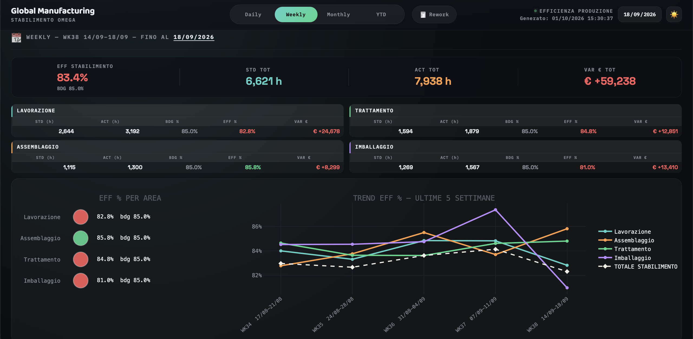

# 🏭 Interactive Plant Efficiency Dashboard (Serverless SPA)

## 📌 The Problem
Legacy plant reporting often relies on heavy, localized Excel files (`.xlsm`) that require manual data refreshes. This causes data latency, bottlenecks during daily Ops stand-up meetings, and limits accessibility for managers outside the local network.

## 💡 The Solution
A highly interactive, standalone **Single Page Application (SPA)** for variance analysis (Standard vs Actual) and rework cost tracking. 

I engineered an automated Python ETL pipeline that bypasses Excel entirely. Instead of relying on a dedicated backend server, the Python script computes rolling aggregations and packages the payload into a Base64/GZIP format injected directly into a generic HTML template. 

*Note: The mock data generator perfectly simulates standard cost accounting rules, ensuring positive economic variances accurately flag budget overruns (Red).*

## 🚀 Tech Stack
* **Data Processing:** Python, `pandas` (for in-memory rolling aggregations and KPI calculations).
* **Data Visualization:** `plotly` (server-side pre-rendering).
* **Frontend:** Vanilla JS, Custom CSS (Dark/Light mode, Interactive Sparklines, Offline hydration).
* **Architecture:** 100% Serverless. Offline JSON hydration allows instant filtering (Day/Week/Month/YTD) directly in the browser.

## 📸 Sneak Peek

