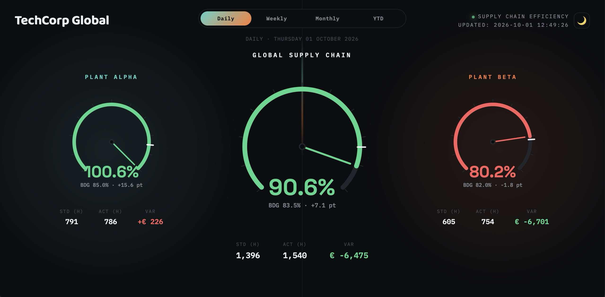

# 🌐 Supply Chain Command Deck

## 📌 The Problem
Executive management needed a real-time, high-level summary of the entire manufacturing supply chain, aggregating standard vs. actual variances across multiple independent production facilities without getting bogged down in individual cost-center data. 

## 💡 The Solution
A "Command Deck" Single Page Application featuring custom-built SVG vector gauges. The Python backend computes the mathematical aggregation of multiple plant environments (Plant Alpha + Plant Beta) to extract the true overarching Supply Chain efficiency (Standard Hours vs Actual Hours and economic variances).

## 🚀 Tech Stack
* **Data Aggregation:** Python (cross-plant data normalization and economic variance calculation).
* **Frontend Data Visualization:** Vanilla JavaScript and dynamically constructed SVGs directly calculating polar coordinates for precision "Pressure Gauge" arcs.
* **Architecture:** 100% Serverless JSON-hydrated SPA. No API polling needed; click "Weekly" or "YTD" for instantaneous interactive transitions.

## 📸 Sneak Peek

