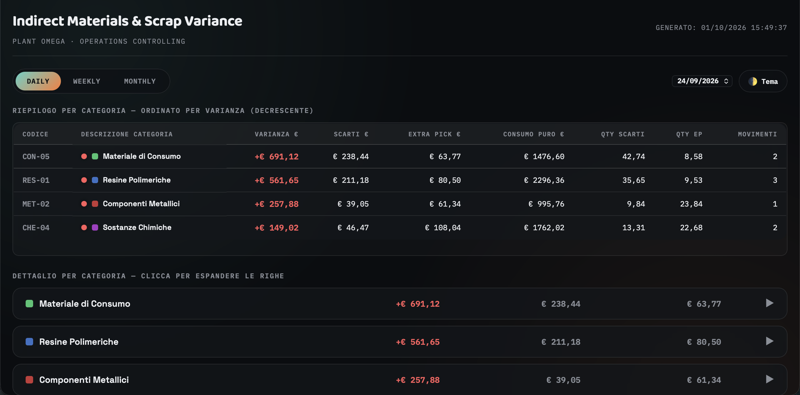
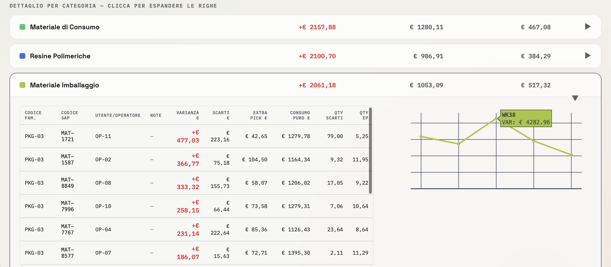

# 📦 Indirect Materials & Scrap Variance Tracker

## 📌 The Problem
Controlling indirect materials consumption, scrap rates, and extrapicking variances was a highly manual, dual-step process. Controllers had to pull raw data from SAP into Excel, run macros to pivot the data, identify the worst-performing cost centers, and prepare static reports for operational meetings. 

## 💡 The Solution
I completely decoupled the data extraction from the presentation layer. This script bypasses heavy local Excel macros and instead acts as a **Serverless Data Engine**. It takes raw simulated ERP dumps, applies variance accounting rules (Standard vs Actual), and outputs a standalone, lightning-fast Single Page Application (SPA).

*Note: The mock data generator perfectly simulates real-world variance accounting. Extraconsumption (Actual > Standard) is correctly flagged as a negative impact (Red / Positive Variance in €), while savings are flagged as positive impact (Green).*

## 🚀 Tech Stack
* **Data Processing:** Python, `pandas` (for robust aggregation, daily/weekly rolling sums, and data normalization).
* **Data Visualization:** `plotly` (server-side pre-rendering embedded directly in HTML).
* **Frontend:** Vanilla JS, Custom CSS (Dynamic expandable tables, Dark/Light mode, Offline hydration).
* **Architecture:** 100% Serverless.

## 📸 Sneak Peek

