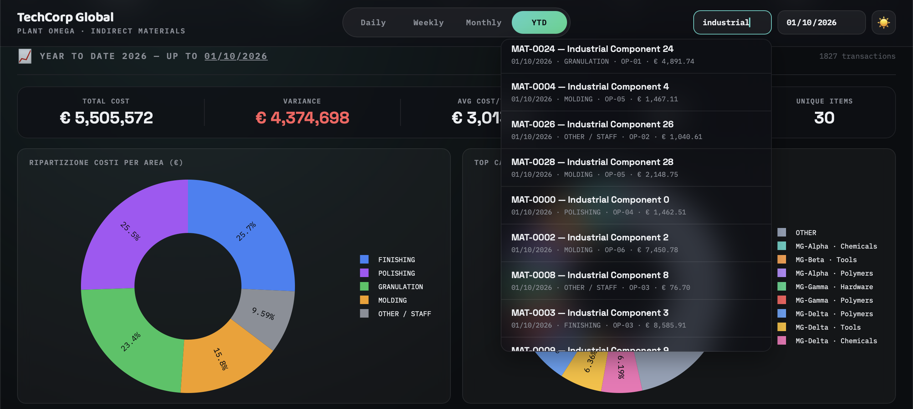
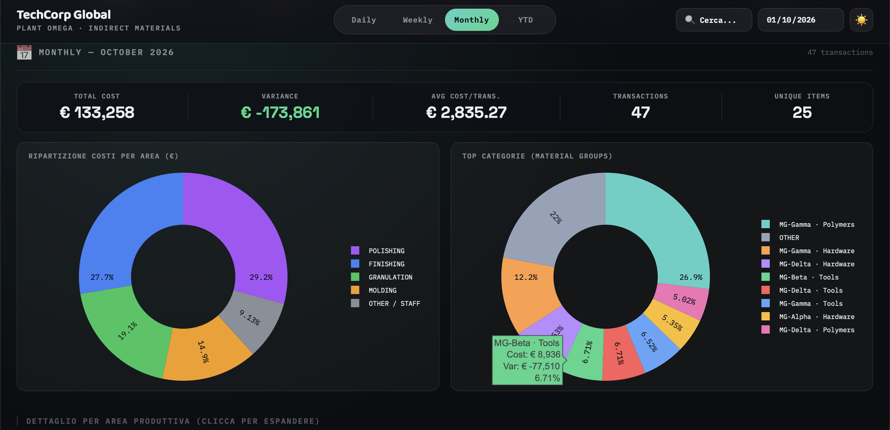
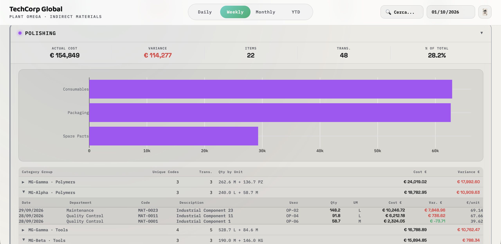

# 📦 Indirect Materials Analytics Engine

## 📌 The Problem
Controlling indirect materials across multiple production areas is complex. Operations Managers need to track daily consumption, compare it against rolling budgets, and drill down from high-level categories (e.g., Polymers, Spare Parts) to individual transactions and users. Traditional ERP exports are heavy, slow, and require manual pivoting.

## 💡 The Solution
A highly optimized, serverless SPA (Single Page Application) that acts as an in-browser BI tool. The Python backend processes raw mock ERP transactions and budget allocations, compresses them into indexed JSON payloads, and injects them into the HTML. 

The frontend then handles dynamic filtering (Day/Week/Month/YTD), variance calculations, and even includes a **lightning-fast client-side search engine** that instantly locates specific material codes or users without needing a database connection.

## 🚀 Tech Stack
* **Data Processing:** Python, `pandas` (for robust aggregation, daily/weekly rolling sums, and data normalization).
* **Data Visualization:** `plotly` (server-side pre-rendering embedded directly in HTML).
* **Frontend:** Vanilla JS, Custom CSS (Client-side indexing for sub-millisecond search, expandable cascading tables, Dark/Light mode).
* **Architecture:** 100% Serverless. 

## 📸 Sneak Peek
*(Add a screenshot of the dashboard showing the expanded tables or the search bar in action)*

