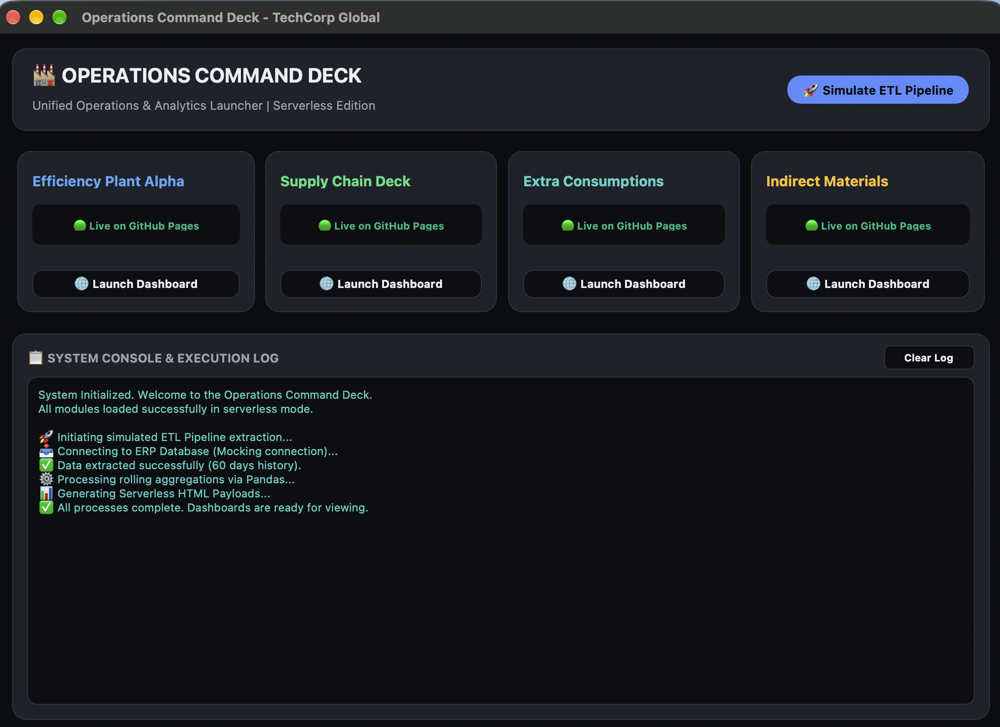

# 💻 Operations Command Deck (Desktop GUI)

## 📌 Context & Problem
While web-based dashboards are excellent for executive presentation, the actual Operations Controllers on the factory floor needed a centralized, robust desktop application to trigger complex ETL pipelines, interact with local ERP databases, and manage multiple local Python servers.

## 💡 The Solution (Internal Tool Showcase)
I developed a native Windows Desktop application using `CustomTkinter`. This tool acts as the "Command Center" for the Operations team. 

*Note: This repository contains a standalone, web-linked demo version of the original factory app, reconfigured to open the GitHub Pages portfolio dashboards instead of trying to ping local network databases.*

## 🚀 Technical Highlights
This project demonstrates advanced Python Software Engineering skills:
* **Multithreading:** Heavy ETL data extractions and server booting run on background `daemon` threads to ensure the UI remains 100% responsive.
* **Thread-Safe UI Updates:** Implemented a robust `queue.Queue` pattern to allow background threads to safely pass UI update requests back to the main `tkinter` event loop.
* **Console Redirection:** Custom class to hijack `sys.stdout` and pipe all print statements directly into a stylized in-app terminal window.
* **Dynamic GUI:** Adaptive Dark/Light mode depending on system settings.

## 📸 Interface Preview
*(The GUI launching the automated data extraction and logging the output)*


## ⚙️ Try the Demo
To test the desktop interface locally:
```bash
pip install customtkinter
python desktop_launcher_demo.py
